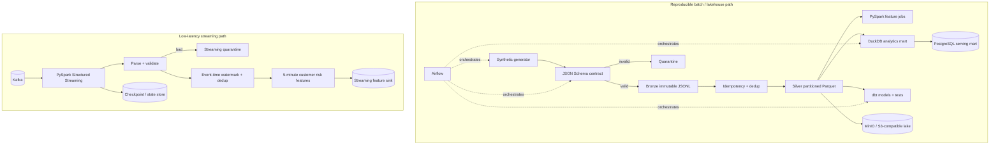

# FinTech Data Platform

An end-to-end synthetic transaction platform built around **data contracts, idempotent ingestion, Bronze/Silver lakehouse layers, Parquet, DuckDB, dbt, Airflow, PostgreSQL, PySpark batch processing and Structured Streaming**.

The same logical architecture can run locally with DuckDB/MinIO/PostgreSQL and translate to AWS, GCP or Azure data stacks.

> All data in this repository is synthetic. No employer, customer or production financial data is included.

## Architecture



## Why this project exists

Financial-data engineering has requirements that toy ETL examples often hide:

- explicit **schemas/contracts** and quarantine paths;
- idempotency under at-least-once delivery;
- immutable raw history for replay and reconciliation;
- point-in-time-safe feature engineering;
- different storage shapes for analytics vs serving;
- data-quality tests in the pipeline rather than after dashboards break;
- bounded retries and orchestration semantics;
- Spark shuffle/skew behavior at larger scale;
- event time, late data, checkpointing and state in streaming systems.

## Replay and identity contract

Batch ingestion uses two identities deliberately:

- the SHA-256 digest of the input bytes creates a deterministic `run_id`;
- `event_id` is the business identity, while a canonical payload digest detects mutation.

An SQLite ingestion ledger reserves business IDs before Silver publication and commits them only
after partition files are atomically renamed. An exact file retry records a new attempt manifest
but writes zero rows. A later overlapping batch writes only unseen IDs. Reusing an existing
`event_id` with different content is recorded as a producer conflict and sent to quarantine rather
than being silently accepted or mislabeled as a duplicate. Failed publication releases only that
run's uncommitted reservations, enabling a safe retry.

Each attempt produces `data/manifests/transactions/run=<digest>/attempt=<n>.json`. CI uploads these
manifests with the built warehouse as inspectable evidence.

## Quick start — local batch path

```bash
python -m venv .venv
source .venv/bin/activate        # Windows: .venv\Scripts\activate
pip install -r requirements.txt

python -m src.generate_transactions --count 10000
python -m src.pipeline data/incoming/transactions.jsonl
python -m src.build_mart
```

Inspect the local mart:

```bash
python - <<'PY'
import duckdb
con = duckdb.connect('data/warehouse/fintech.duckdb')
print(con.sql('select * from high_velocity_customers limit 10').df())
PY
```

## Local infrastructure

```bash
docker compose up -d
python -m src.object_store --bucket fintech-lakehouse
python -m src.postgres_load
```

The development stack includes an S3-compatible object store and PostgreSQL serving warehouse.

## Data layers

### Contract

`contracts/transaction.schema.json` defines the transaction event contract. `src/validate_event.py`
uses JSON Schema and produces a canonical payload digest. Batch, dbt and Spark paths all use
`event_id`; CI includes a local Spark regression test so schema drift between those paths fails.

### Bronze

Accepted raw events are preserved as immutable run-scoped JSONL so ingestion can be replayed and debugged.

### Quarantine

Malformed or contract-invalid records retain validation errors instead of disappearing silently.

### Silver

Valid unique events are materialized as **partitioned Parquet**, with ingestion metadata for lineage.

### Analytical / serving marts

`src/build_mart.py` materializes examples such as:

- `fact_transactions`;
- `customer_daily_activity`;
- `high_velocity_customers`.

The dbt project independently demonstrates staging models, analytical marts, uniqueness/not-null assertions and repeatable transformations.

## PySpark banking feature engineering

`spark/banking_features.py` demonstrates leakage-aware transaction features:

- explicit input schema;
- duplicate transaction removal;
- 24-hour / 7-day / 30-day historical windows;
- count, amount and volatility features;
- cross-border and night-time activity;
- previous-transaction lag;
- seconds since prior transaction;
- peer-group amount z-score;
- partitioned Parquet output.

Historical windows end **before** the current event where practical so the current row does not leak into its own historical feature.

## Spark performance / skew lab

`spark/performance_lab.py` covers the questions that appear after a DataFrame grows beyond laptop scale:

- formatted physical-plan inspection;
- broadcast hash joins for genuinely small dimensions;
- explicit repartitioning for large joins;
- hot-key detection;
- selective key salting for skew;
- Adaptive Query Execution;
- skew-join handling;
- Catalyst-friendly built-ins instead of row-wise Python UDFs;
- partitioned/compressed Parquet output and small-file awareness.

See `docs/spark_performance.md` for the interview/runbook notes.

## Structured Streaming

`spark/structured_streaming.py` demonstrates a complementary Kafka → Structured Streaming path:

```text
Kafka
  ↓
JSON/schema parsing
  ↓
validation + quarantine
  ↓
event-time watermark
  ↓
bounded transaction-ID deduplication
  ↓
sliding 5-minute customer aggregates
  ↓
checkpointed feature sink
```

Features include transaction velocity, amount sum/max, cross-border count, night activity and approximate merchant diversity.

The important concepts are not the buzzwords. The implementation/docs make explicit:

- event time vs processing time;
- late-arriving data;
- watermark/state-retention trade-offs;
- bounded deduplication;
- checkpoint recovery;
- consumer lag/backpressure;
- streaming quarantine;
- why short-window streaming features and long-horizon historical features may use different state/storage strategies.

See `docs/structured_streaming.md` for operating and failure-mode notes.

## Orchestration

`airflow/dags/fintech_pipeline.py` defines the batch dependency chain:

```text
generate_synthetic_events
        ↓
contract_to_silver
        ↓
build_local_mart
        ↓
dbt_build
```

The DAG uses bounded retries and `max_active_runs=1` so overlapping batch behavior is explicit.

## Batch and streaming are complementary

```text
streaming -> low-latency operational signals / recent velocity
batch     -> complete history / backfill / training / reconciliation
```

A realistic platform needs reconciliation between these paths instead of pretending a streaming system eliminates the need for reproducible historical data.

## Cloud translation

| Local / logical component | AWS | GCP | Azure |
|---|---|---|---|
| MinIO / Parquet | S3 | Cloud Storage | ADLS / Blob |
| DuckDB/dbt analytics | Athena/Glue/Redshift + dbt | BigQuery + dbt | Synapse/Fabric + dbt |
| PostgreSQL | RDS/Aurora | Cloud SQL/AlloyDB | Azure Database for PostgreSQL |
| Airflow | MWAA | Cloud Composer | Managed Airflow / Data Factory |
| Event bus | MSK/Kinesis | Pub/Sub | Event Hubs |
| Stream compute | EMR/Spark/Flink | Dataflow / Dataproc Spark | Databricks / Stream Analytics |
| Contract/quarantine | Schema Registry + validation | Pub/Sub schema + Dataflow | Event Hubs schema + quality jobs |

## Interview topics represented

**OLTP vs OLAP · Parquet · partition pruning · schema evolution · data contracts · idempotency · deduplication · Bronze/Silver · dbt tests · Airflow · Spark windows · point-in-time features · shuffles · broadcast joins · skew · AQE · Kafka · Structured Streaming · event time · watermarks · late data · checkpointing · backpressure · object storage · PostgreSQL · lineage.**

## CI

GitHub Actions lints the complete Python surface, exercises replay/conflict integration tests,
builds the deterministic lakehouse and dbt marts, validates Compose, and uploads manifests plus
the warehouse. A separate Java 17/PySpark job executes feature-window and streaming-validation
tests locally. Kafka recovery remains a documented integration boundary rather than a mocked
claim.
