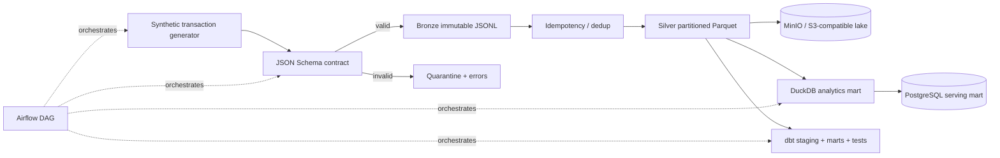

# FinTech Data Platform

An end-to-end transaction data platform built around **data contracts, idempotent ingestion, Bronze/Silver lakehouse layers, Parquet, DuckDB, dbt, Airflow, S3-compatible object storage and PostgreSQL serving marts**.

This repository is deliberately infrastructure-friendly: the same logical pipeline can run locally with DuckDB/MinIO/PostgreSQL and map to S3 + Glue/Athena/Redshift, GCS + BigQuery, or Blob/ADLS + Synapse/Fabric-style deployments.

## Architecture



## Why this project exists

Financial-data pipelines have requirements that are easy to hide in toy ETL scripts:

- events need explicit **schemas/contracts** and quarantine paths;
- at-least-once delivery means consumers must understand **idempotency and deduplication**;
- raw history should remain reproducible instead of being silently overwritten;
- analytics storage and serving storage often have different workload shapes;
- quality tests belong in the pipeline, not in someone's notebook after the dashboard is wrong;
- orchestration must make retry and dependency behavior explicit.

## Quick start

```bash
python -m venv .venv
source .venv/bin/activate        # Windows: .venv\Scripts\activate
pip install -r requirements.txt

python -m src.generate_transactions --count 10000
python -m src.pipeline data/incoming/transactions.jsonl
python -m src.build_mart
```

Inspect the local mart:

```bash
python - <<'PY'
import duckdb
con = duckdb.connect('data/warehouse/fintech.duckdb')
print(con.sql('select * from high_velocity_customers limit 10').df())
PY
```

## Local infrastructure

Bring up an S3-compatible object store and PostgreSQL warehouse:

```bash
docker compose up -d
python -m src.object_store --bucket fintech-lakehouse
python -m src.postgres_load
```

MinIO console is exposed on `localhost:9001`, S3 API on `9000`, and PostgreSQL on `5432`.

## Data layers

### Contract

`contracts/transaction.schema.json` defines the event contract. `src/validate_event.py` uses JSON Schema Draft 2020-12 plus format checking and also provides a stable SHA-256 idempotency key.

### Bronze

The original accepted input stream is written as immutable run-scoped JSONL. Keeping raw history makes ingestion replay/debugging possible.

### Quarantine

Malformed JSON and contract-invalid events are written with validation errors rather than silently discarded.

### Silver

Valid unique transactions are stored as **partitioned Parquet by `event_date`**, with an ingestion run identifier for lineage.

### Marts

`src/build_mart.py` materializes:

- `fact_transactions`
- `customer_daily_activity`
- `high_velocity_customers`

The dbt project independently demonstrates staging models, analytical marts and assertions such as uniqueness/not-null checks.

## Orchestration

`airflow/dags/fintech_pipeline.py` defines:

```text
generate_synthetic_events
        ↓
contract_to_silver
        ↓
build_local_mart
        ↓
dbt_build
```

The DAG uses bounded retries and `max_active_runs=1` to make overlapping batch behavior explicit.

## Cloud translation

| Local component | AWS | GCP | Azure |
|---|---|---|---|
| MinIO / Parquet | S3 | Cloud Storage | ADLS / Blob |
| DuckDB/dbt | Athena/Glue/Redshift + dbt | BigQuery + dbt | Synapse/Fabric + dbt |
| PostgreSQL | RDS/Aurora | Cloud SQL/AlloyDB | Azure Database for PostgreSQL |
| Airflow | MWAA | Cloud Composer | Managed Airflow / Data Factory orchestration |
| Contract/quarantine | Glue Schema Registry / validation jobs | Pub/Sub schemas / Dataflow | Event Hubs schema + data quality jobs |

## Interview topics represented

**OLTP vs OLAP · Parquet columnar storage · partition pruning · schema evolution · data contracts · idempotency · deduplication · quarantine/DLQ thinking · Bronze/Silver layers · dbt tests · orchestration/retries · object storage · COPY-based warehouse loading · lineage.**

## CI

GitHub Actions runs Ruff and pytest, generates deterministic synthetic transactions, executes the complete Contract → Silver → DuckDB path, runs `dbt build`, and validates the Docker Compose definition.

All data in this repository is synthetic. No employer or production financial data is included.
