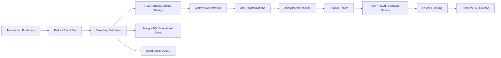

# Fintech Data Platform

A public, synthetic-data reference architecture for event-driven fintech analytics and ML feature pipelines.

## Architecture

## What this repo demonstrates

- event-driven ingestion
- schema validation and data contracts
- idempotent processing
- Airflow DAG orchestration
- dbt-style SQL transformations
- PostgreSQL analytics modeling
- Parquet lake-style storage
- data quality assertions
- feature engineering boundaries
- model-serving integration points
- observability-friendly metrics

No real customer, employer, banking or transaction data is included.
