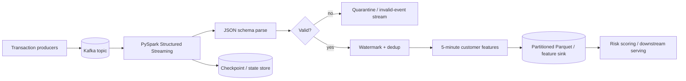

# Structured Streaming — Transaction Risk Features

The batch lakehouse path in this repository is useful for reproducible training and analytics. Some financial-risk signals, however, lose value if they are calculated hours later. `spark/structured_streaming.py` demonstrates the complementary event-time streaming path.

## Architecture



## Why event time matters

Kafka arrival time is not automatically the business event time. Mobile connectivity, retries and upstream buffering can cause records to arrive out of order.

The pipeline therefore uses `event_time` for windows and a configurable watermark. The watermark tells Spark how long state should be retained for late data before old windows can be finalized.

A good interview answer distinguishes:

- **event time** — when the transaction actually happened;
- **processing time** — when the streaming job saw it;
- **watermark** — an operational bound on how much lateness the system tolerates.

## Deduplication

At-least-once delivery can produce duplicate records. The public example uses the stable `transaction_id` with `dropDuplicatesWithinWatermark` so duplicate state remains bounded by the watermark rather than growing forever.

Exactly-once is a property of the **end-to-end pipeline**, not a magic Kafka checkbox. Source offsets, Spark checkpointing and sink behavior all matter.

## Features

The streaming example generates bounded five-minute features including:

- transaction count;
- amount sum / maximum;
- cross-border count;
- night-time count;
- approximate merchant diversity.

Long-horizon 7d/30d customer features are better handled by a deliberately designed feature-state architecture rather than by casually retaining unbounded Structured Streaming state. In production, one option is to combine short-window stream aggregates with an online feature store containing materialized historical features.

## Checkpointing

The checkpoint directory stores query progress and state metadata. Deleting it is not equivalent to restarting the same query: the application may replay or lose its previous progress depending on the source/sink configuration.

Operational rules:

1. use a durable checkpoint location;
2. use a separate checkpoint per logical query;
3. version incompatible state/schema changes deliberately;
4. monitor checkpoint/state-store growth;
5. test recovery from process termination.

## Late-data trade-off

A larger watermark tolerates more delayed events but retains more state and delays final window completion. A smaller watermark reduces state/latency but drops more late records from stateful updates.

The value is therefore an SLO/business decision, not just a Spark tuning knob.

## Backpressure and throughput

If input rate exceeds sustainable processing rate, consumer lag grows. Useful diagnostics include:

- input rows/sec vs processed rows/sec;
- micro-batch duration;
- Kafka consumer lag;
- state-store size;
- shuffle read/write;
- executor CPU/memory;
- sink commit latency.

Possible responses include scaling executors, increasing partitions, reducing expensive state, tuning trigger intervals, addressing skew or temporarily applying upstream rate controls.

## Fault scenarios to discuss

### Duplicate events

Stable event IDs + bounded dedup state.

### Out-of-order events

Event-time windows + watermark.

### Malformed payloads

Visible quarantine path rather than silent drop.

### Consumer restart

Restore source progress/state from checkpoint.

### Schema change

Version event contracts and deploy compatible readers before incompatible producers.

### Hot customer key

Inspect partition skew; consider upstream keying, state design or selective salting depending on the computation.

### Sink unavailable

Micro-batches retry/fail according to the sink/query behavior. Alerts must distinguish source lag from downstream sink failure.

## Batch + streaming together

The portfolio architecture deliberately keeps both:

```text
streaming path -> low-latency risk features / operational signals
batch path     -> complete history / training / backfills / reconciliation
```

A mature platform reconciles the two instead of treating streaming as a replacement for reproducible batch history.

## GCP translation

The same pattern can be mapped to:

```text
Pub/Sub -> Dataflow / Dataproc Spark -> BigQuery / GCS / online feature serving
```

The important transferable ideas are event-time semantics, schema contracts, idempotency, bounded state, checkpointing, late-data policy and observability—not the vendor logos.
